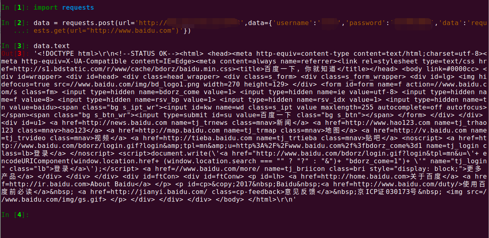

# 项目简介

这是一个 **代理IP** 的小demo,当前为0.1版本，可以做到在任意一台服务器上一键部署，一键启动，使该服务器为你提供代理IP服务。

该demo今后的发展方向是在内网机器上部署，通过统一的服务器集群来转发请求，可以做到在服务器数量有限的情况下，获得大量的代理IP。

当前环境为：

```shell
代理IP服务器环境：
ubuntu
python
django
requests
uwsgi
nginx
# 没有列出版本号，默认为最新版本
```

## 启动项目

启动项目的前提是，首先你的服务器上要有 **Docker**

因为这里上传的是dockerfile文件和docker镜像

### ① 通过dockerfile生成一个镜像

进入项目文件夹,执行以下指令

```shell
docker build -t [镜像名字]:[版本号] .

# 示例
docker build -t pmip:0.1 .
```

### ②通过镜像创建容器并运行

```shell
docker run -d -p [服务器端口]:80 [镜像名字]:[版本号]

# 示例
docker run -d -p 8888:80 pmip:0.1
```

到这里就已经实现了代理IP的功能

## 使用方法

```python
data = requests.post(url='http://[代理服务器IP]:[暴露的端口]',data={'username':'mth','password':'123456','data':[目标爬虫语句]})
```

其中 **username**和 **password**的值是默认的，如果要更改的话，可以进入容器目录：/home/PMIP/PMIP/settings.py	最下方可以更改为你自己的用户名和密码，更改完成之后需要重启uwsgi,指令是

```shell
# 查看容器
docker ps
# 进入容器
docker exec -it [容器编号] /bin/bash
# 修改django配置文件
vim /home/PMIP/PMIP/settings.py
# 用户名和密码在最下面
# 先关闭uwsgi
ps -ef | grep 'uwsgi' | grep -v grep | awk '{print $2}' | xargs sudo kill -9
uwsgi --stop uwsgi.pid
# 再启动
uwsgi -i /home/PMIP/PMIP/uwsgi.ini
# 退出容器并保持运行
Ctrl+P+Q
```


## 测试

```python
data = requests.post(url='http://127.0.0.1:8888',data={'username':'mth','password':'123456','data':'requests.get(url="http://www.baidu.com")'})
```



## 最后

欢迎关注我的微信公众号：


不定期更新 **python** 相关技术文章，都是自己写的哟