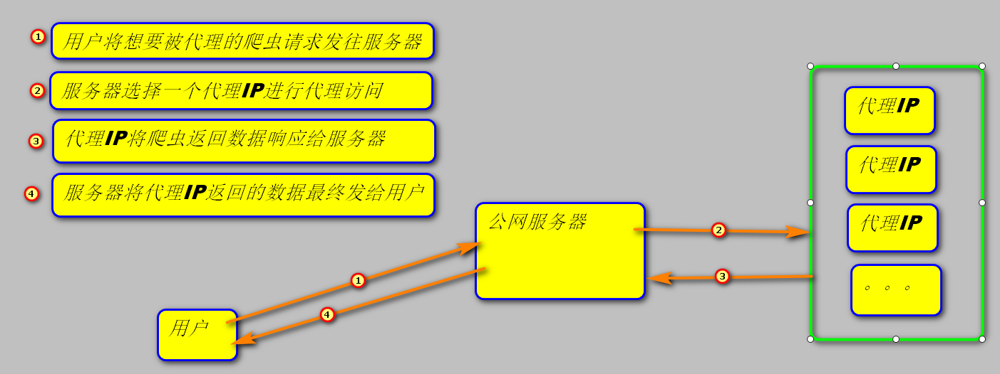
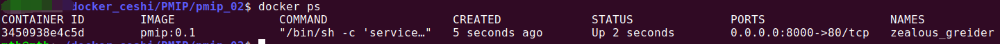
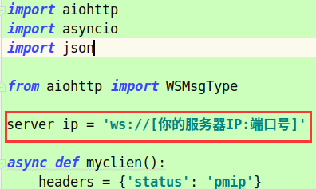
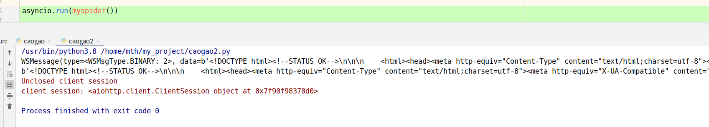

# PMIP 0.2


这是一个 **代理IP** 的小项目,当前为0.2版本，该版本分为三端，服务器端，代理IP端，用户端

可以做到在任意一台公网服务器和任意内网电脑上一键部署，一键启动，使该服务器通过内网机器为你提供代理IP服务。可以做到在服务器数量有限的情况下，部署更多的代理IP

该项目今后的发展方向是在手机上部署代理IP端，以获得更多的代理IP

当前环境为：

```shell
ubuntu 20.04
python 3.8
aiohttp
asyncio
django 3.1
daphne
nginx
```

项目流程图：




看起来很简单的4个步骤，在技术选型上却想了很久，曾经想过轮询和消息队列的模型，都遇见一个无法绕过的问题：服务器和用户连接的这个进程，如何才能知道代理IP那边已经完成了任务？

后来突发奇想，能不能让TCP的连接不断开，有这个保证的话，可能会想到一些办法。我就上百度去搜，发现这个技术已经有了，就是**websocket**，这名字我是见过的，在我爬取招聘网站信息提取关键词的时候，我还以为那是socket的一种别称，就没注意过它……

# 食用步骤：

## ① 在公网服务器端部署：

进入到pmip_02目录下，构建docker镜像

```shell
# 进入到pmip_02目录下，修改settings.py文件中的 KEY 值，他是客户端连接时验证身份的钥匙，默认为'123456' （该值在文件最下面）
**@**:/****/pmip_02$ vim server/myasgi/myasgi/settings.py
# 构建镜像
**@**:/****/pmip_02$ sudo docker build -t pmip:0.2 .
# 成功之后运行容器
docker run -d -p [自定义主机端口]:80 pmip:0.2
# 查看容器是否运行
docker ps
```




## ② 在内网机器上部署代理IP端环境：

```shell
# 进入pmip_02/pmip目录
mth@mth:~/docker_ceshi/PMIP/pmip_02/pmip$ 
# 修改pmip.py文件下 server_ip 的值为你自己的服务器IP+上一步暴露的端口号
vim pmip.py
# 构建镜像 (该步骤需要下载许多东西，容易因为网络问题报错，可以多试几次，肯定是可以成功的，亲测)
**@**:/****/pmip_02$ sudo docker build -t pmip_ip:0.1 .
# 成功之后运行容器
docker run -d pmip_ip:0.1
# 查看容器是否运行
docker ps
```



## ③ 模拟客户端发起请求

```python
import aiohttp
import asyncio


async def myspider():
    # key = 你在第一步的服务端修改的KEY值，默认为123456
    headers = {'status': 'clien', 'key': '123456'}
    # 代理IP发起请求时，使用的请求头
    target_headers = {'useragent': 'la'}
    session = aiohttp.ClientSession(headers=headers)
    async with session.ws_connect('ws://[你的服务器IP:端口]') as ws:
        # url 和 method
        await ws.send_json({'headers': target_headers, 'url': 'http://www.baidu.com', 'method': 'get'})
        data = await ws.receive()
        print(data)
        print(data.data)


asyncio.run(myspider())
```



到这里，整个项目就启动成功了，欢迎点赞分享


## 欢迎关注我的微信公众号：不定期更新一些python相关的文章

